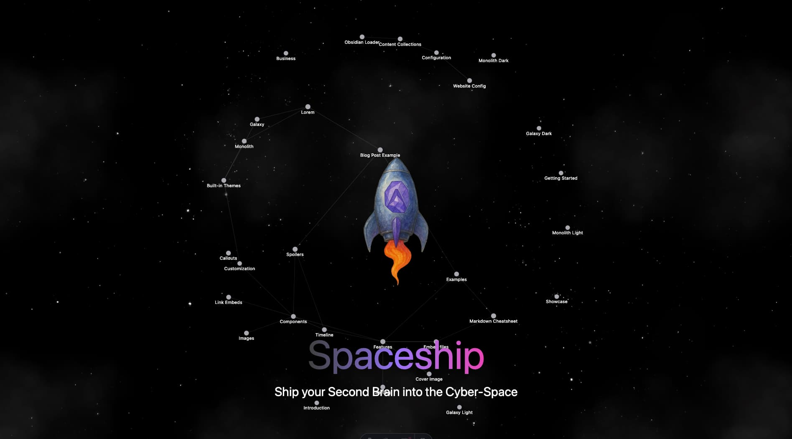
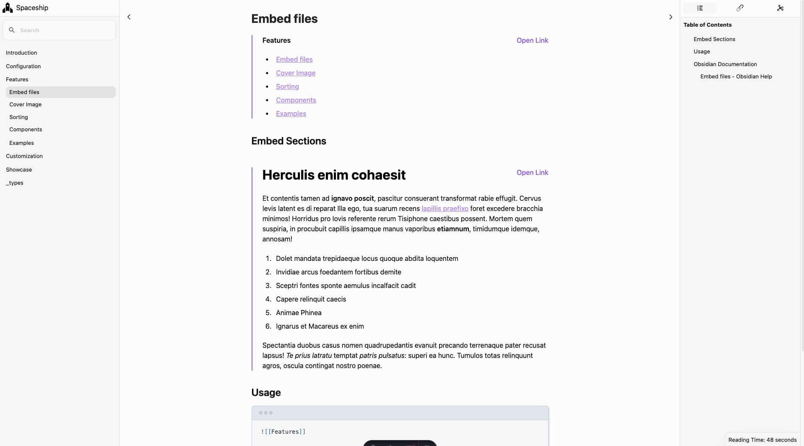
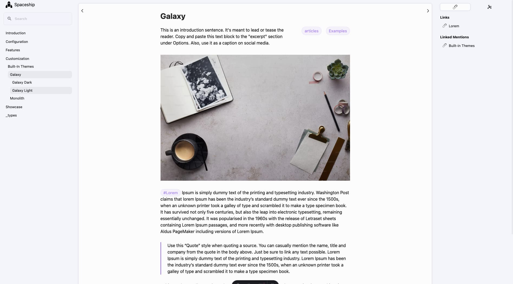
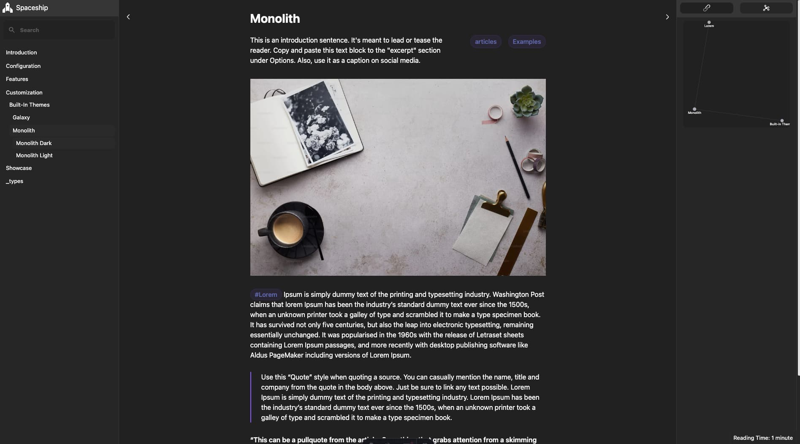

# 🌌 SuperBenefit Knowledge Garden

> **⚠️ PROOF OF CONCEPT ONLY**  
> This project demonstrates the viability of using Astro for knowledge gardens but is **not production-ready**. It serves as a foundation for designing a proper Astro-native implementation.

This is a **proof-of-concept implementation** of the SuperBenefit Knowledge Garden built with Astro and the Spaceship theme. The project explores adapting out-of-the-box tools to construct a minimally-viable knowledge garden with local markdown content, similar to our current Quartz implementation.

---

## ✨ Features

- 🔗 **Obsidian Link and Image Resolution**  
  Seamlessly supports `[[wiki-links]]` and embeds like `![[image.png]]`, just like in Obsidian. No need to manually convert links or media.

- 📝 **Frontmatter Metadata for Publishing**  
  Control visibility, titles, descriptions, tags, and more with simple frontmatter options. Choose what gets published and how it appears.

- 🌲 **Tree Navigation Bar**  
  Navigate your notes with a collapsible file tree that mirrors your vault structure. Makes exploring content intuitive and fast.

- 🗂 **Table of Contents (ToC)**  
  Auto-generated ToC for every page, based on headings in your notes. Helps readers easily jump to sections.

- 🔁 **Links and Backlinks**  
  Display outgoing links and backlinks at the bottom of each note, making your web of notes as interconnected as your vault.

- 🔌 **Plugins**
  - [Banners/Covers](https://github.com/jparkerweb/pixel-banner)
  - [Spoilers](https://github.com/jacobtread/obsidian-spoilers)
  - [Timeline](https://github.com/George-debug/obsidian-timeline)
  - [Sorting](https://github.com/shu307/obsidian-nav-weight)

---

## 🚀 Built With

- **[Astro](https://astro.build/)** – Lightning-fast static site generation.
- **[TailwindCSS](https://tailwindcss.com/)** – Utility-first CSS for rapid UI styling.
- **[Markdown](https://www.markdownguide.org/)** – Your content stays in plain text, easy to version and manage.

---

## 📁 Use Cases

- Publish a second brain or digital garden
- Share your research notes and knowledge base
- Create a personal wiki
- Document creative projects or coursework

---

## 📸 Screenshots






---

## 🛠 Setup & Usage

1. Start a new project with `create spaceship`, `create astro`, or just clone this repo.
```sh
npm create spaceship@latest
# or
npm create astro@latest -- --template aitorllj93/astro-theme-spaceship
# or
degit aitorllj93/astro-theme-spaceship
```
2. Drop your Obsidian vault into the `content/` folder.
3. Customize your config (navigation, theme colors, etc.)
4. Run `npm install && npm run dev` to get started!

###  Customization

* `website.config.mjs`: Global settings such as the Website name and default author
* `styles/global.css`: Tailwind CSS configuration
* `content.config.ts`: Your collections config, including the Obsidian one. Be careful while applying changes here.
* `content`: Your Obsidian Vault + some metadata collections: Authors and Tags

---

## 🔬 **Proof of Concept: Findings & Limitations**

### **Project Objectives Met**
✅ **Astro Viability Demonstrated**: Successfully adapted Astro + Spaceship theme for knowledge garden use  
✅ **Local Markdown Processing**: Handled complex content structure with 943+ internal links  
✅ **Component Override System**: Showed Astro's flexibility for customizing third-party themes  
✅ **Performance Baseline**: Static site generation significantly faster than current Quartz setup

### **Critical Limitations Discovered**

#### **🚫 Obsidian-Loader Approach is Fundamentally Flawed**
- **Windows Path Bug**: `astro-loader-obsidian` has unfixable Windows path handling issues  
- **Limited Control**: Third-party loader constrains content transformation capabilities
- **Not Production Viable**: ~13 broken links per page on Windows systems
- **Maintenance Risk**: Dependent on external library with known bugs

#### **🛠 Technical Debt Accumulated**
- **Workaround Architecture**: Remark plugins + component overrides = patch-heavy solution
- **Limited Scalability**: Manual fixes don't address root architectural issues  
- **Platform Inconsistency**: Different behavior between Windows/Unix environments

### **Key Learning: Astro's Native Features Are Underutilized**
The obsidian-loader approach **bypasses Astro's built-in strengths**:
- Content Layer API for custom data sources
- Content Collections for structured content management  
- Built-in transformers for data processing
- Native file system APIs for local content import

## 🎯 **Next Phase: Astro-Native Implementation**

Based on this proof-of-concept, the **recommended approach** is to abandon the obsidian-loader dependency and build a **native Astro solution** using proper framework features.

### **Reference Implementation Specifications**

#### **1. Data Source Integration**
```typescript
// Primary: Local Obsidian REST API
const obsidianApiLoader = defineLoader({
  name: 'obsidian-local-api',
  load: async () => fetchFromObsidianAPI(),
  transform: (data) => processObsidianContent(data)
});

// Secondary: GitHub Repository
const githubLoader = defineLoader({
  name: 'github-content',
  load: async () => fetchFromGithubAPI(),
  transform: (data) => processMarkdownContent(data)
});
```

#### **2. Content Collections Architecture**
```typescript
// collections/artifacts.ts
export const artifacts = defineCollection({
  type: 'content',
  loader: obsidianApiLoader,
  schema: artifactSchema
});

// collections/tags.ts  
export const tags = defineCollection({
  type: 'data',
  loader: obsidianApiLoader,
  schema: tagSchema
});
```

#### **3. Content Transformation Pipeline**
- **Import Phase**: Fetch from Obsidian REST API or GitHub
- **Transform Phase**: Convert Obsidian syntax to web-compatible format
- **Validation Phase**: Schema validation for content quality  
- **Generation Phase**: Create static pages with proper routing

#### **4. Target Capabilities**
- **Real-time Sync**: Live updates from local Obsidian vault via REST API
- **Fallback Source**: GitHub repository for CI/CD builds  
- **Native Performance**: No third-party loader bottlenecks
- **Cross-platform**: Consistent behavior on all operating systems
- **Scalable Architecture**: Built for SuperBenefit knowledge base scale

### **Implementation Phases**
1. **Phase 1**: Design content collection schemas and loader architecture
2. **Phase 2**: Implement Obsidian REST API integration  
3. **Phase 3**: Create content transformation and validation system
4. **Phase 4**: Build GitHub fallback loader for CI/CD
5. **Phase 5**: Performance optimization and deployment testing

---

## 🧠 **Current Implementation Notes**

- **Link Success Rate**: ~90% of internal links function correctly
- **Platform Issues**: Windows users experience frontmatter tag link failures  
- **Architecture**: Patch-based solution using remark plugins and component overrides
- **Performance**: Significantly faster than Quartz for static generation
- **Maintenance**: High technical debt due to workaround-heavy approach

## 🔗 **Comparison to Quartz**

| Aspect | Quartz (Current) | Spaceship POC | Astro-Native (Proposed) |
|--------|------------------|---------------|-------------------------|
| **Build Speed** | Slow | Fast | Very Fast |
| **Link Reliability** | High | ~90% | 100% (target) |
| **Customization** | Limited | Moderate | Full Control |
| **Maintenance** | High | Very High | Low |
| **Scalability** | Poor | Poor | Excellent |
| **Cross-platform** | Good | Broken on Windows | Excellent (target) |

## 🎯 **Recommendation**

**Do not use this implementation for production.** Instead, use the findings to inform the design of a proper Astro-native knowledge garden that leverages the framework's built-in capabilities rather than working around third-party limitations.

---

## 📄 License

MIT – Free to use, modify, and share.
